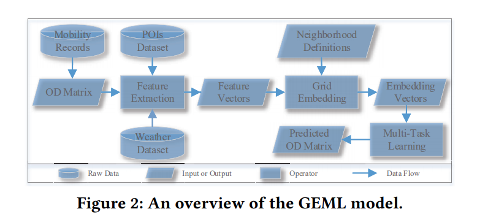

# Demand Prediction

|      | 日期 | 题目                                                         | 作者                              | 来源 | 模型                                                         | 亮点 |
| ---- | ---- | ------------------------------------------------------------ | --------------------------------- | ---- | ------------------------------------------------------------ | ---- |
| 1    | 2018 | [Combining time-series and textual data for taxi demand prediction in event areas: a deep learning approach](../papper/demand_prediction/Combiningtime-seriesandtextualdatafortaxidemand.pdf) | Filipe Rodriguesa, Ioulia Markoua |      |  |      |
| 2    | 2018 | [Deep Multi-View Spatial-Temporal Network for Taxi Demand Prediction](p./papper/demand_prediction/DeepMulti-ViewSpatial-TemporalNetworkforTaxiDemandPrediction.pdf) | Yitian Jia, Siyu Lu               |      |  |      |
| 3    | 2018 | [Hexagon-Based Convolutional Neural Network for Supply-Demand Forecasting of Ride-Sourcing Services](./papper/demand_prediction/TITS-Hexagon-BasedConvolutionalNeuralNetworkforsupply-demandforecasting.pdf) | Jintao Ke, Hai Yang               |      |  |      |
| 4    | 2018 | [Predicting Multi-step Citywide Passenger Demands Using Attention-based Neural Networks](./papper/demand_prediction/PredictingMulti-stepCitywidePassengerDemandsUsing.pdf) | Xian Zhou, Yanyan Shen            |      |  |      |
| 5    | 2019 | [Co-Prediction of Multiple Transportation Demands Based on Deep Spatio-Temporal Neural Network](./papper/demand_prediction/Co-PredictionofMultipleTransportationDemandsBased.pdf) | Junchen Ye, Leilei Sun            |      |  |      |
| 6    | 2019 | [Origin-Destination Matrix Prediction via Graph Convolution: a New Perspective of Passenger Demand Modeling](./papper/demand_prediction/Origin-DestinationMatrixPredictionviaGraphConvolutiona.pdf) | Yuandong Wang, Hongzhi Yin        |      |                  |      |
| 7    | 2019 | [Predicting Taxi Demand Based on 3D Convolutional Neural Network and Multi-task Learning](./papper/demand_prediction/PredictingTaxiDemandBasedon3DConvolutional.pdf) | Li Kuang, Xuejin Yan              |      |  |      |
| 8    | 2019 | [STG2Seq: Spatial-temporal Graph to Sequence Model for Multi-step Passenger Demand Forecasting](./papper/demand_prediction/STG2SeqSpatial-temporalGraphtoSequenceModel.pdf) | Lei Bai , Lina Yao                |      |  |      |
| 9    | 2020 | [Taxi Demand Prediction Using Parallel Multi-Task Learning Model](./papper/demand_prediction/TaxiDemandPredictionUsingParallelMulti-TaskLearningModel.pdf) | Chizhan Zhang, Fenghua Zhu        |      |  |      |
| 10   | 2020 | [Traffic Demand Prediction Based on Dynamic Transition Convolutional Neural Network]() | Bowen Du, Xiao Hu                 |      |  |      |

