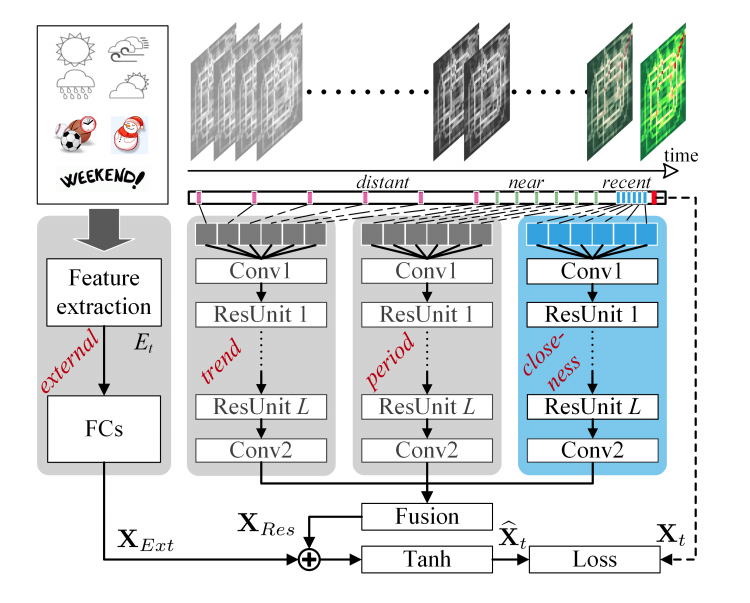
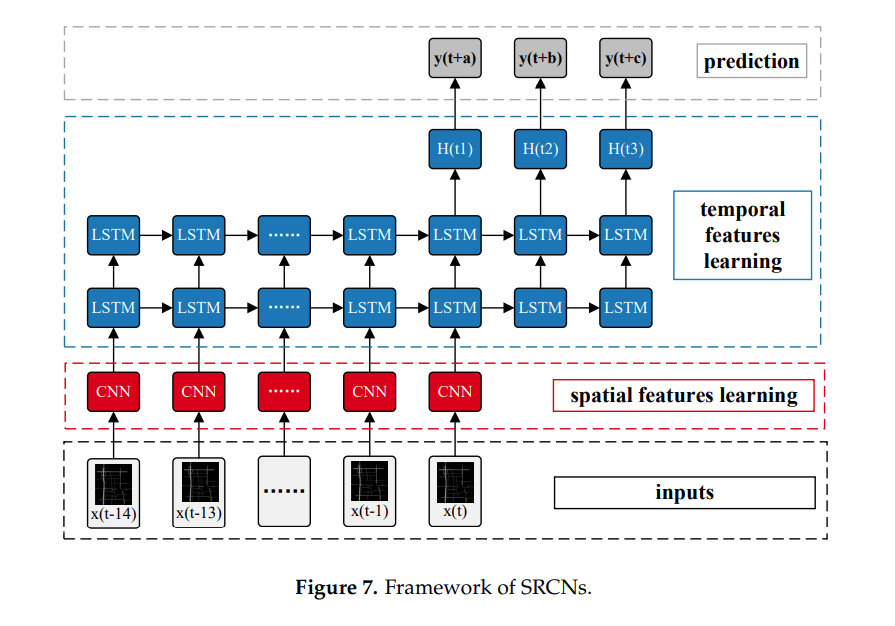

# Flows Prediction

|      | 日期 |                             题目                             |              作者              |                             来源                             | 模型                                                         | 亮点 |
| ---- | :--: | :----------------------------------------------------------: | :----------------------------: | :----------------------------------------------------------: | ------------------------------------------------------------ | ---- |
|      | 2015 | [Traffic Flow Prediction With Big Data: A Deep Learning Approach](..\/papper\/flows_predction\/Traffic Flow Prediction With Big Data A Deep L.pdf) |    Yisheng Lv, Yanjie Duan     |                                                              |                                                              |      |
|      | 2015 | [Traffic Flow Prediction for Road Transportation Networks With Limited Traffic Data](..\/papper\/flows_prediction\/TITS.2014.2337238.pdf) | Afshin Abadi, Tooraj Rajabioun |                                                              |                                                              |      |
|      | 2017 | [Deep Spatio-Temporal Residual Networks for Citywide Crowd Flows Prediction](..\/papper\/flows_prediction\/Deep Spatio-Temporal Residual Networks for Citywide Crowd Flows Prediction.pdf) |        J Zhang，Y Zheng        |                                                              |  |      |
|      | 2017 | [Spatiotemporal Recurrent Convolutional Networks for Traffic Prediction in Transportation Networks](papper\flows_prediction\Spatiotemporal Recurrent Convolutional Networks.pdf) |     Haiyang Yu, Zhihai Wu      |                                                              |                 |      |
|      | 2018 | [GeoMAN: Multi-level Attention Networks for Geo-sensory Time Series Prediction](papper/flows_prediction/0476.pdf) |    Yuxuan Liang, Songyu Ke     |                           IJCAI-18                           |            |      |
|      | 2019 | [Attention Based Spatial-Temporal Graph Convolutional Networks for Traffic Flow Forecasting](papper\flows_prediction\3881-Article Text-6940-1-10-20190702.pdf) |   Shengnan Guo，Youfang Lin    |                                                              |            |      |
|      | 2019 | [DeepSTD: Mining Spatio-Temporal Disturbances of Multiple Context Factors for Citywide Traffic Flow Prediction](papper\flowes_prediction\TITS2932785-proof2.pdf) |                                |                                                              |          |      |
|      | 2019 | [Flow Prediction in Spatio-Temporal Networks Based on Multitask Deep Learning](papper\flows_prediction\Flow Prediction in Spatio-Temporal Networks.pdf) |        J Zhang，Y Zheng        |                                                              |                  |      |
|      | 2019 | [GSTNet: Global Spatial-Temporal Network for Traffic Flow Prediction](papper\flows_prediction\0317.pdf) |      Shen Fang , Qi Zhang      |                                                              |            |      |
|      | 2019 | [Revisiting Spatial-Temporal Similarity: A Deep Learning Framework for Traffic Prediction](papper\flows_prediction\Revisiting Spatial-Temporal Similarity.pdf) |   Huaxiu Yao, Xianfeng Tang    |                           AAAI-19                            |                |      |
|      | 2019 | [ST-Attn: Spatial-Temporal Attention Mechanism for Multi-step Citywide Crowd Flow Prediction](papper\flows_prediction\ST-Attn Spatial-Temporal Attention Mechanism for.pdf) |     Yirong Zhou, Hao Chen      | 2019 International Conference on Data Mining Workshops (ICDMW） |            |      |
|      | 2019 | [STAR: A Concise Deep Learning Framework for Citywide Human Mobility Prediction](papper\flows_prediction\star_mdm19.pdf) |     Hongnian Wang, Han Su      | 2019 20th IEEE International Conference on Mobile Data Management (MDM) |                |      |
|      | 2019 | [Urban Traffic Prediction from Spatio-Temporal Data Using Deep Meta Learning](papper\flows_prediction\UrbanTrafficPredictionfromSpatio-TemporalDataUsingDeepMetaLearning.pdf) |    Zheyi Pan, Yuxuan Liang     |                                                              |    |      |
|      | 2019 | [UrbanFM: Inferring Fine-Grained Urban Flows](papper\flows_prediction\UrbanFM Inferring Fine Grained Urban Flows.pdf) |    Yuxuan Liang, Kun Ouyang    |                                                              |          |      |
|      | 2020 | Spatial-Temporal Convolutional Graph Attention Networks for Citywide Traffic Flow Forecasting |    Xiyue Zhang, Chao Huang     |                                                              |                                                |      |
|      | 2020 | [AutoST: Efficient Neural Architecture Search for Spatio-Temporal Prediction](papper\flows_prediction\AutoST Efficient Neural Architecture Search for.pdf) |      Ting Li, Junbo Zhang      |                                                              |            |      |
|      | 2020 | [Citywide Traffic Flow Prediction Based on Multiple Gated Spatio-temporal Convolutional Neural Networks](papper\flows_prediction\Citywide Traffic Flow Prediction Based on Multiple Gated.pdf) |          C Chen，K Li          |                                                              |              |      |
|      | 2020 | [Deep Learning Architecture for Short-Term Passenger Flow Forecasting in Urban Rail Transit](papper\flows_prediction/TITS.2020.3000761.pdf) |    Jinlei Zhang, Feng Chen     |                                                              |          |      |
|      | 2020 | [Dynamic Spatial-Temporal Representation Learning for Traffic Flow Prediction](papper\flows_prediction\1909.02902.pdf) |    Lingbo Liu, Jiajie Zhen     |        [Github](https://github.com/liulingbo918/ATFM)        |                  |      |
|      | 2020 | [Multi-Graph Convolutional Network for Short-Term Passenger Flow Forecasting in Urban Rail Transit](papper/flows_prediction/Multi-Graph Convolutional Network for Short-Term Passenger Flow Forecasting.pdf) |    Jinlei Zhang, Feng Chen     |                                                              |  |      |
|      | 2020 | [Physical-Virtual Collaboration Modeling for Intra-and Inter-Station Metro Ridership Prediction](papper\flows_prediction\Physical-Virtual Collaboration Modeling for.pdf) |    Lingbo Liu, Jingwen Chen    |                                                              |              |      |
|      | 2020 | [Physical-Virtual Collaboration Modeling for Intra-and Inter-Station Metro Ridership Prediction](papper\flows_prediction\Physical-Virtual Collaboration Modeling for.pdf) |    Lingbo Liu, Jingwen Chen    |        [Github](https://github.com/HCPLab-SYSU/PVCGN)        |                                                              |      |
|      | 2020 | [Predicting Citywide Crowd Flows in Irregular Regions Using Multi-View Graph Convolutional Networks](papper\flows_prediction\1903.07789.pdf) |    Junkai Sun, Junbo Zhang     |                                                              |  |      |
|      | 2020 | [Preserving Dynamic Attention for Long-Term Spatial-Temporal Prediction](papper/flows_prediction/2006.08849.pdf) |    Haoxing Lin, Weijia Jia     |                         SIGKDD 2020                          |                |      |
|      | 2020 | [Revisiting Convolutional Neural Networks for Citywide Crowd Flow Analytics](papper\flows_prediction\Revisiting Convolutional Neural Networks for.pdf) |    Yuxuan Liang, Kun Ouyang    |                                                              |                                                              |      |
|      | 2020 | [Self-Attention ConvLSTM for Spatiotemporal Prediction](papper\flows_prediction\6819-Article Text-10048-1-10-20200524.pdf) |     Zhihui Lin, Maomao Li      |                           AAAI-20                            |  |      |
|      | 2020 | [Spatial-Temporal Synchronous Graph Convolutional Networks: A New Framework for Spatial-Temporal Network Data Forecasting](papper\flows_prediction\5438-Article Text-8663-1-10-20200511.pdf) |     Chao Song, Youfang Lin     |                                                              |            |      |
| 1.   | 2007 | [Adaptive Seasonal Time Series Models for Forecasting Short-Term Traffic Flow](../papper/flows_prediction/AdaptiveSeasonalTimeSeriesModelsTRR2024.pdf) |     S Shekhar，B Williams      |                                                              |                                                              |      |
| 2.   | 2013 | [An Improved K-nearest Neighbor Model for Short-term Traffic Flow Prediction](papper\flows_prediction\An Improved K-nearest Neighbor Model for Short-term Traffic.pdf) |     Lun Zhang, Qiuchen Liu     |                                                              |      |      |

