# GNN

Application of graph neural network in spatio-temporal data

## Survey

| 编号 | 日期 |                                        题目                                         |           作者           |
| :--: | ---- | :---------------------------------------------------------------------------------: | :----------------------: |
|  1   | 2019 | [**A Comprehensive Survey on Graph Neural Networks**](../papper/gnn/1901.00596.pdf) | _Zonghan Wu, Shirui Pan_ |

## Papper

| 编号 | 日期 | 题目                                                         | 作者                             | 框架                                                         |
| ---- | ---- | ------------------------------------------------------------ | -------------------------------- | ------------------------------------------------------------ |
| 1    | 2018 | [Bike Flow Prediction with Multi-Graph Convolutional Networks](../papper/gnn/1807.10934.pdf) | Di Chai , Leye Wang              | 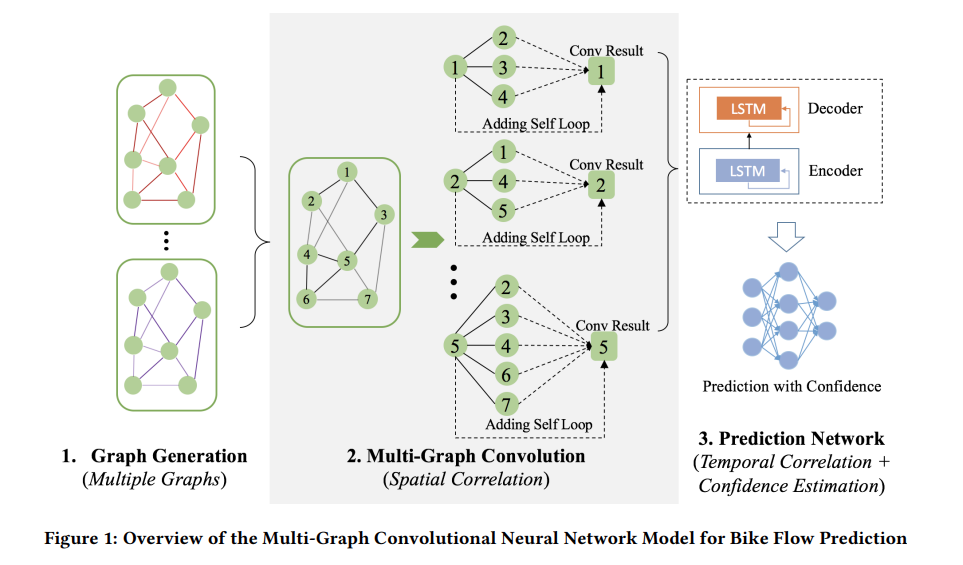 |
| 2    | 2018 | [Spatio-Temporal Graph Convolutional Networks: A Deep Learning Framework for Traffic Forecasting]() | Bing Yu, Haoteng Yin             | 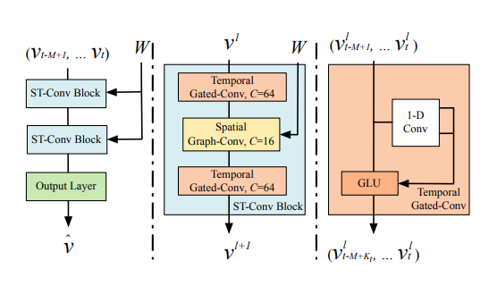                             |
| 3    | 2018 | [T-GCN: A Temporal Graph Convolutional Network for Traffic Prediction](../papper/gnn/1811.05320.pdf) | Ling Zhao, Yujiao Song           | 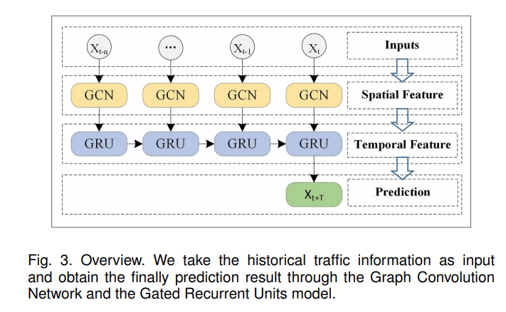                             |
| 4    | 2019 | [Attention Based Spatial-Temporal Graph Convolutional Networks for Traffic Flow Forecasting](../papper/gnn/10.1609@aaai.v33i01.3301922.pdf) | Shengnan Guo, Youfang Lin        | 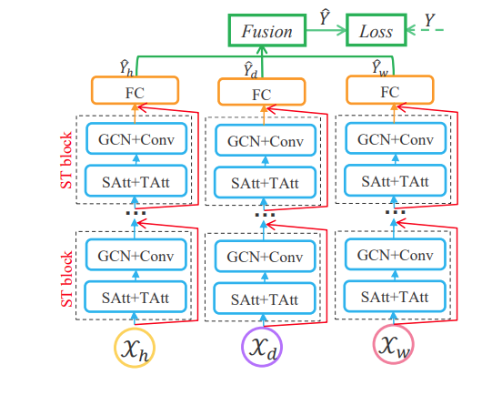                           |
| 5    | 2019 | [GMAN: A Graph Multi-Attention Network for Traffic Prediction](../papper/gnn/1911.08415.pdf) | Chuanpan Zheng, Xiaoliang Fan    | 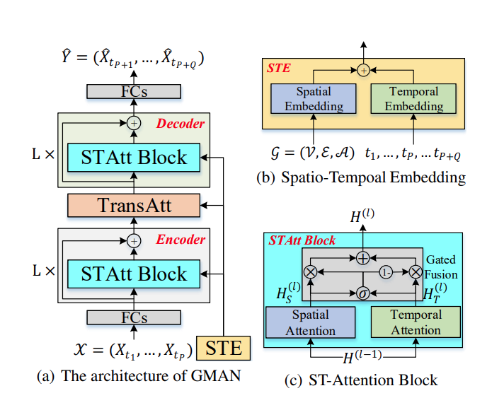                               |
| 6    | 2019 | [Optimized Graph Convolution Recurrent Neural Network for Traffic Prediction](../papper/gnn/10.1109@TITS.2019.2963722.pdf) | Kan Guo, Yongli Hu               | 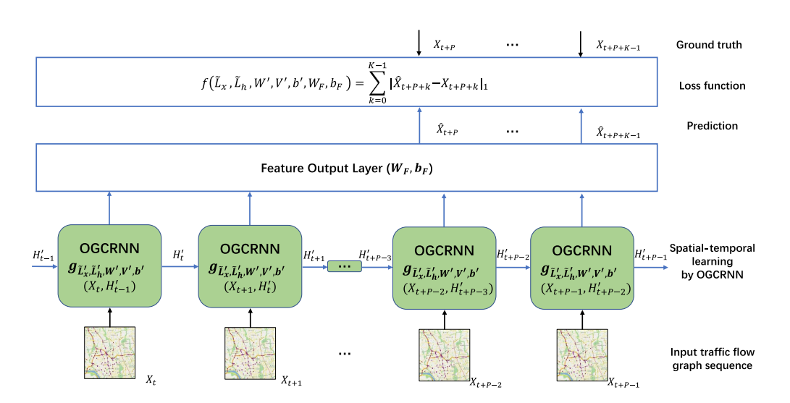                             |
| 7    | 2020 | [Dynamic Graph Convolution Network for Traffic Forecasting Based on Latent Network of Laplace Matrix Estimation](../papper/gnn/10.1109@TITS.2020.3019497.pdf) | Kan Guo, Yongli Hu               | 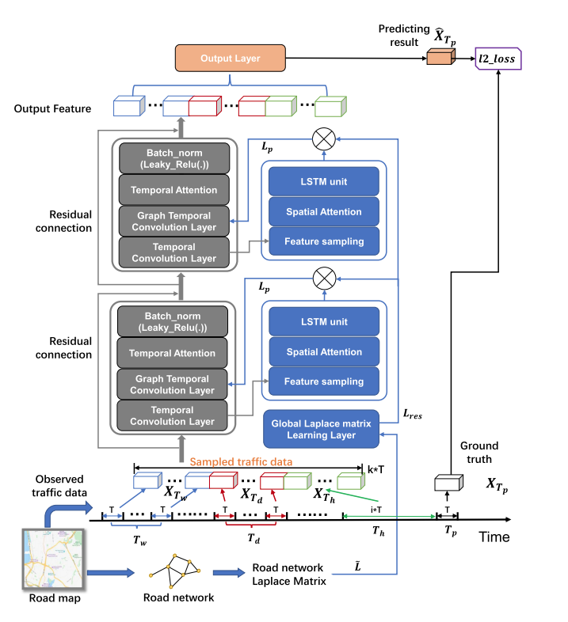                             |
| 8    | 2020 | [Dynamic Spatio-temporal Graph-based CNNs for Traffic Flow Prediction](../papper/gnn/1812.02019.pdf) | KEN CHEN, FEI CHEN               | 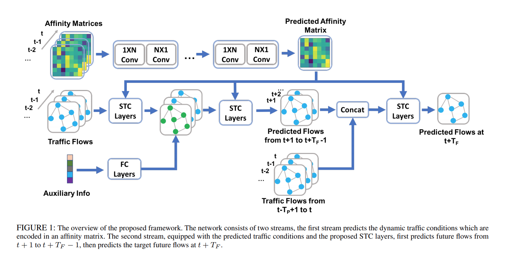                             |
| 9    | 2020 | [Hybrid Spatio-Temporal Graph Convolutional Network: Improving Traffic Prediction with Navigation Data](../papper/gnn/2006.12715.pdf) | Rui Dai, Shenkun Xu              | 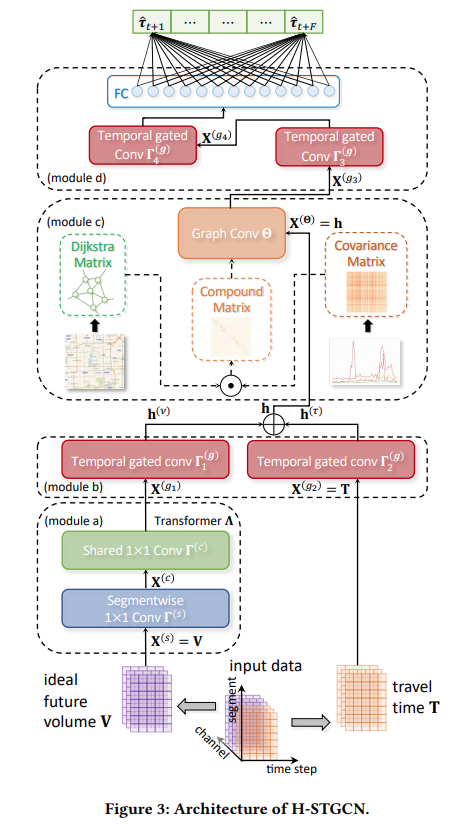                         |
| 10   | 2020 | [LSGCN: Long Short-Term Traffic Prediction with Graph Convolutional Networks](../papper/gnn/0326.pdf) | Rongzhou Huang, Chuyin Huang     | 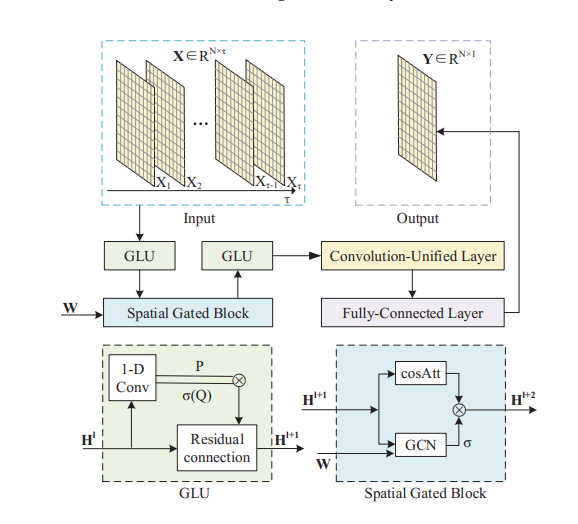                             |
| 11   | 2020 | [Multi-Range Attentive Bicomponent Graph Convolutional Network for Traffic Forecasting](../papper/gnn/1911.12093.pdf) | Weiqi Chen, Ling Chen            | 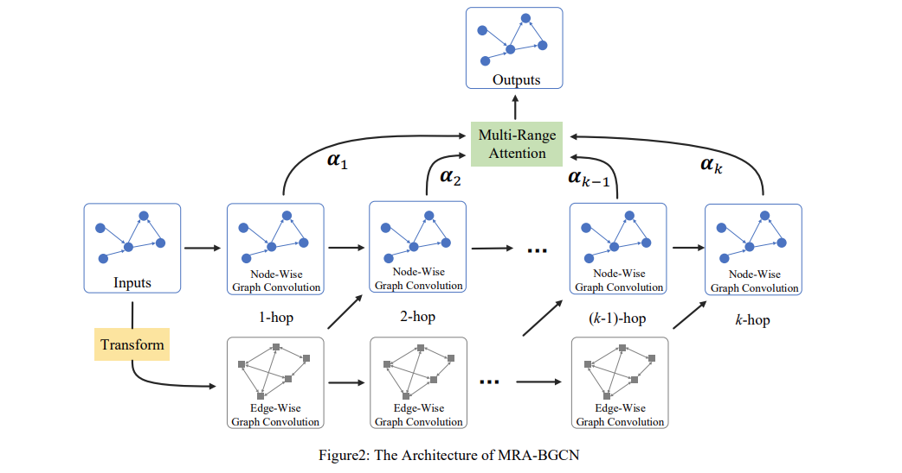                       |
| 12   | 2020 | [ST-GRAT: A Novel Spatio-temporal Graph Attention Networks for Accurately Forecasting Dynamically Changing Road Speed](../papper/gnn/3340531.3411940.pdf) | Cheonbok Park, Chunggi Lee       | 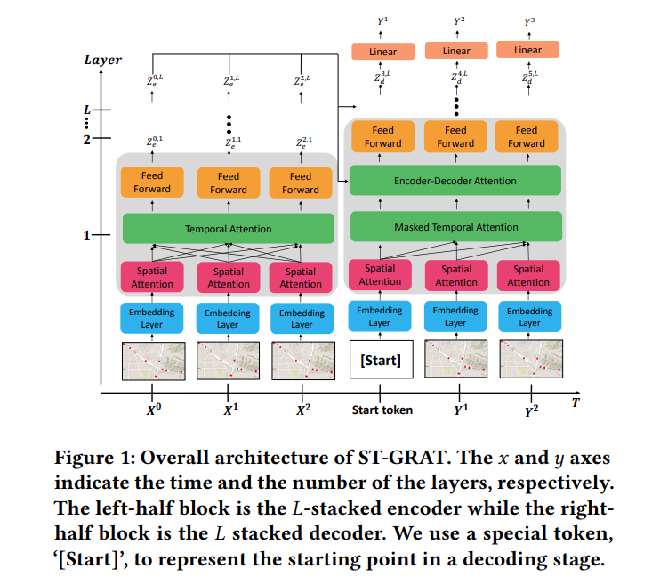                         |
| 13   | 2020 | [Spatial-Temporal Synchronous Graph Convolutional Networks: A New Framework for Spatial-Temporal Network Data Forecasting](../papper/gnn/song2020.pdf) | Chao Song, Youfang Lin           | 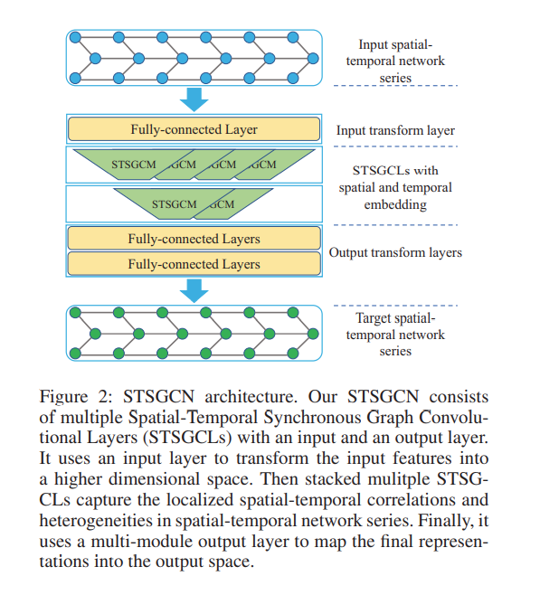                           |
| 14   | 2020 | [Spatio-Temporal Graph Structure Learning for Traffic Forecasting](../papper/gnn/zhang2020.pdf) | Qi Zhang, Jianlong Chang         |                              |
| 15   | 2020 | [Temporal Multi-Graph Convolutional Network for Traffic Flow Prediction](../papper/gnn/lv2020.pdf) | Mingqi Lv, Zhaoxiong Hong        | 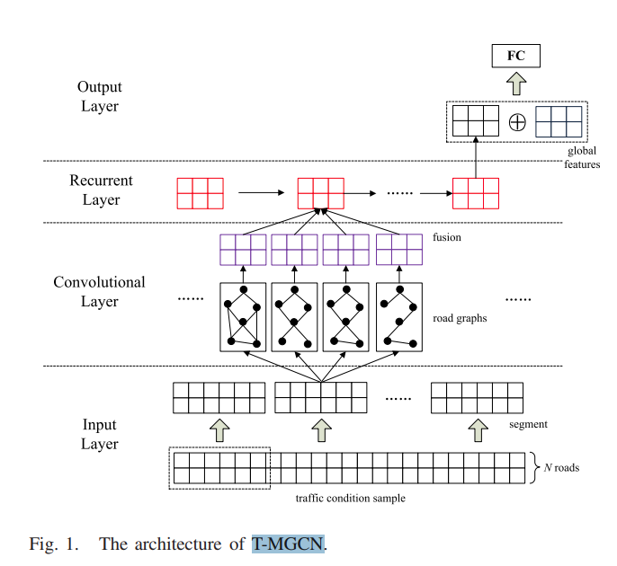                           |
| 16   | 2020 | [Traffic Graph Convolutional Recurrent Neural Network: A Deep Learning Framework for Network-Scale Traffic Learning and Forecasting](../papper/gnn/1802.07007.pdf) | Zhiyong Cui, Kristian Henrickson | 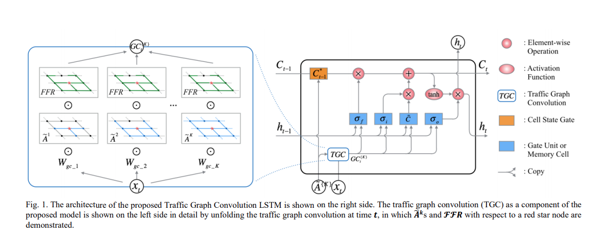 |

