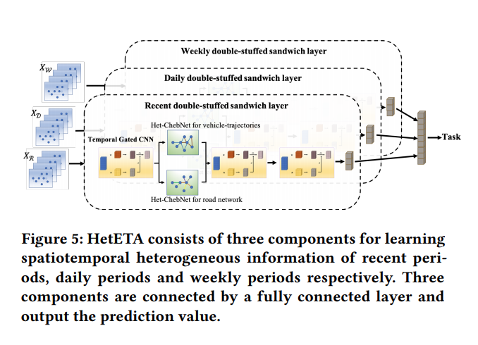
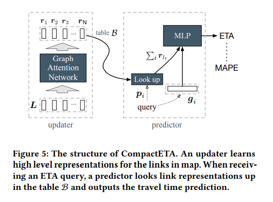

# Travel time or Arrive time Prediction

|      | 日期 | 题目                                                         | 作者                      | 框架                                         |
| ---- | ---- | ------------------------------------------------------------ | ------------------------- | -------------------------------------------- |
|      | 2020 | [HetETA: Heterogeneous Information Network Embedding for Estimating Time of Arrival](../papper/ttoat/3394486.3403294.pdf) | Huiting Hong, Yucheng Lin |          |
|      | 2020 | [CompactETA: A Fast Inference System for Travel Time Prediction](../papper/ttoat/3394486.3403386.pdf) | Kun Fu, Fanlin Meng       |  |
|      |      |                                                              |                           |                                              |

